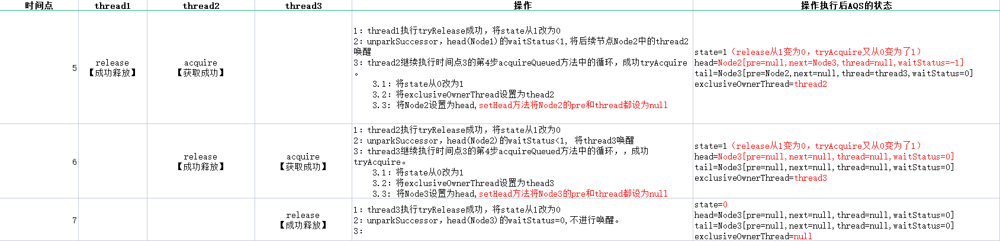

##一：AbstractQueuedSynchronizer的介绍、内部变量、和cas相关方法
```java
/**
 * Provides a framework for implementing blocking locks and related
 * synchronizers (semaphores, events, etc) that rely on
 * first-in-first-out (FIFO) wait queues.  This class is designed to
 * be a useful basis for most kinds of synchronizers that rely on a
 * single atomic {@code int} value to represent state. Subclasses
 * must define the protected methods that change this state, and which
 * define what that state means in terms of this object being acquired
 * or released.  Given these, the other methods in this class carry
 * out all queuing and blocking mechanics. Subclasses can maintain
 * other state fields, but only the atomically updated {@code int}
 * value manipulated using methods {@link #getState}, {@link
 * #setState} and {@link #compareAndSetState} is tracked with respect
 * to synchronization.
 * 提供一个框架，用于实现依赖先进先出（FIFO）等待队列的阻塞锁和相关同步器（信号量、事件等）。
 * 此类被设计为大多数类型的同步器的有用基础类，这些同步器依赖于单个原子 int 值来表示状态。
 * 子类必须定义更改此状态的受保护方法，以及定义此状态在获取或释放此对象方面的含义。
 * 鉴于这些，该类中的其他方法执行所有排队和阻塞机制。子类可以维护其他状态字段，
 * 但只有原子更新的 int 值使用方法 getState 、 setState 和 compareAndSetState 在同步方面被跟踪。
 *
 * <p>Subclasses should be defined as non-public internal helper
 * classes that are used to implement the synchronization properties
 * of their enclosing class.  Class
 * {@code AbstractQueuedSynchronizer} does not implement any
 * synchronization interface.  Instead it defines methods such as
 * {@link #acquireInterruptibly} that can be invoked as
 * appropriate by concrete locks and related synchronizers to
 * implement their public methods.
 * 子类应定义为非公共内部帮助器类，用于实现其封闭类的同步属性。
 * 类 AbstractQueuedSynchronizer 未实现任何同步接口。
 * 相反，它定义了 acquireInterruptibly 等方法，
 * 具体锁和相关同步器可以适当地调用这些方法来实现它们的公共方法。
 *
 * <p>This class supports either or both a default <em>exclusive</em>
 * mode and a <em>shared</em> mode. When acquired in exclusive mode,
 * attempted acquires by other threads cannot succeed. Shared mode
 * acquires by multiple threads may (but need not) succeed. This class
 * does not &quot;understand&quot; these differences except in the
 * mechanical sense that when a shared mode acquire succeeds, the next
 * waiting thread (if one exists) must also determine whether it can
 * acquire as well. Threads waiting in the different modes share the
 * same FIFO queue. Usually, implementation subclasses support only
 * one of these modes, but both can come into play for example in a
 * {@link ReadWriteLock}. Subclasses that support only exclusive or
 * only shared modes need not define the methods supporting the unused mode.
 * 此类支持默认的独占模式和共享模式。在独占模式下获取时，其他线程尝试的获取无法成功。
 * 多线程获取共享模式可能（但不需要）成功。此类不理解这些差异，除了机械意义上的差异，
 * 即当共享模式获取成功时，下一个等待线程（如果存在）还必须确定它是否也可以获取成功。
 * 在不同模式下等待的线程共享相同的FIFO队列。通常，实现子类只支持其中一种模式，
 * 但这两种模式都可以在{@link ReadWriteLock}中发挥作用。
 * 仅支持独占或共享模式的子类不需要定义支持未使用模式的方法。
 *
 * <p>This class defines a nested {@link ConditionObject} class that
 * can be used as a {@link Condition} implementation by subclasses
 * supporting exclusive mode for which method {@link
 * #isHeldExclusively} reports whether synchronization is exclusively
 * held with respect to the current thread, method {@link #release}
 * invoked with the current {@link #getState} value fully releases
 * this object, and {@link #acquire}, given this saved state value,
 * eventually restores this object to its previous acquired state.  No
 * {@code AbstractQueuedSynchronizer} method otherwise creates such a
 * condition, so if this constraint cannot be met, do not use it.  The
 * behavior of {@link ConditionObject} depends of course on the
 * semantics of its synchronizer implementation.
 * 该类定义了一个嵌套的 ConditionObject 类，该类可用作支持独占模式的子类的 ConditionObject 实现，
 * 方法 isHeldExclusively 报告是否对当前线程独占保持同步，
 * 使用当前 getState 的值调用方法 release 完全释放此对象(Condition代码中有体现)，
 * 并且 acquire 给定此保存的状态值，最终将此对象恢复到以前获取的状态(Condition代码中有体现)。
 * 没有 AbstractQueuedSynchronizer 方法会创建这样的 Condition ，
 * 因此如果无法满足此约束，请不要使用它。 ConditionObject 的行为当然取决于其同步器实现的语义。
 *
 * <p>This class provides inspection, instrumentation, and monitoring
 * methods for the internal queue, as well as similar methods for
 * condition objects. These can be exported as desired into classes
 * using an {@code AbstractQueuedSynchronizer} for their
 * synchronization mechanics.
 *
 * 此类提供内部队列的检查、检测和监视方法，以及条件对象的类似方法。
 * 可以根据需要使用{@code AbstractQueuedSynchronizer}作为同步机制将它们导出到类中。
 *
 * <p>Serialization of this class stores only the underlying atomic
 * integer maintaining state, so deserialized objects have empty
 * thread queues. Typical subclasses requiring serializability will
 * define a {@code readObject} method that restores this to a known
 * initial state upon deserialization.
 * 此类的序列化只存储底层原子整数维护状态，因此反序列化对象具有空线程队列。
 * 需要序列化的典型子类将定义一个 readObject 方法，该方法在反序列化时将其恢复到已知的初始状态。
 *
 * <h3>Usage</h3>
 *
 * <p>To use this class as the basis of a synchronizer, redefine the
 * following methods, as applicable, by inspecting and/or modifying
 * the synchronization state using {@link #getState}, {@link
 * #setState} and/or {@link #compareAndSetState}:
 * 要将此类用作同步器的基础，请通过使用 getState 、 setState 和/或 compareAndSetState 
 * 检查和/或修改同步状态，重新定义以下方法（如适用）：
 *
 * <ul>
 * <li> {@link #tryAcquire}
 * <li> {@link #tryRelease}
 * <li> {@link #tryAcquireShared}
 * <li> {@link #tryReleaseShared}
 * <li> {@link #isHeldExclusively}
 * </ul>
 *
 * Each of these methods by default throws {@link
 * UnsupportedOperationException}.  Implementations of these methods
 * must be internally thread-safe, and should in general be short and
 * not block. Defining these methods is the <em>only</em> supported
 * means of using this class. All other methods are declared
 * {@code final} because they cannot be independently varied.
 * 默认情况下，这些方法都会抛出 UnsupportedOperationException 。
 * 这些方法的实现必须是内部线程安全的，并且通常应该是简短的，而不是阻塞的。
 * 定义这些方法是使用此类的唯一受支持的方法。所有其他方法都声明为 final ，因为它们不能独立变化。
 * 其实就是模板模式的应用了。
 *
 * <p>You may also find the inherited methods from {@link
 * AbstractOwnableSynchronizer} useful to keep track of the thread
 * owning an exclusive synchronizer.  You are encouraged to use them
 * -- this enables monitoring and diagnostic tools to assist users in
 * determining which threads hold locks.
 * 您还可能发现从 AbstractOwnableSynchronizer 继承的方法对于跟踪拥有独占同步器的线程非常有用。
 * 我们鼓励您使用它们 ——这使监视和诊断工具能够帮助用户确定哪些线程持有锁。
 *
 * <p>Even though this class is based on an internal FIFO queue, it
 * does not automatically enforce FIFO acquisition policies.  The core
 * of exclusive synchronization takes the form:
 * 即使此类基于内部FIFO队列，它也不会自动强制执行FIFO获得策略。独占同步的核心采用以下形式：
 *
 * <pre>
 * Acquire:
 *     while (!tryAcquire(arg)) {
 *        <em>enqueue thread if it is not already queued</em>;
 *        如果线程还未排队则进行排队
 *        <em>possibly block current thread</em>;
 *        可能会阻塞当前线程
 *     }
 *
 * Release:
 *     if (tryRelease(arg))
 *        <em>unblock the first queued thread</em>;
 *        取消阻塞排队的第一个线程
 * </pre>
 *
 * (Shared mode is similar but may involve cascading signals.)
 * （共享模式类似，但可能涉及级联信号。）
 *
 * <p id="barging">Because checks in acquire are invoked before
 * enqueuing, a newly acquiring thread may <em>barge</em> ahead of
 * others that are blocked and queued.  However, you can, if desired,
 * define {@code tryAcquire} and/or {@code tryAcquireShared} to
 * disable barging by internally invoking one or more of the inspection
 * methods, thereby providing a <em>fair</em> FIFO acquisition order.
 * In particular, most fair synchronizers can define {@code tryAcquire}
 * to return {@code false} if {@link #hasQueuedPredecessors} (a method
 * specifically designed to be used by fair synchronizers) returns
 * {@code true}.  Other variations are possible.
 * 由于在排队之前调用了acquire，因此新的获取线程可能会在被阻塞和排队的其他线程之前乱闯(barge)。
 * 但是，如果需要，您可以定义 tryAcquire 和/或 tryAcquireShared 
 * 以通过内部调用一个或多个检查方法来禁用乱闯（barging），从而提供一个公平的FIFO获取顺序。
 * 特别是，大多数公平同步器可以定义tryAcquire以返回false，
 * 前提是 hasQueuedPredecessors （一种专门为公平同步器设计的方法）返回 true 。
 * 其他变化也是可能的。 初看这个barging的描述很晕，后面看了ReetrentLock的公平和非公平逻辑就明白了。
 *
 * <p>Throughput and scalability are generally highest for the
 * default barging (also known as <em>greedy</em>,
 * <em>renouncement</em>, and <em>convoy-avoidance</em>) strategy.
 * While this is not guaranteed to be fair or starvation-free, earlier
 * queued threads are allowed to recontend before later queued
 * threads, and each recontention has an unbiased chance to succeed
 * against incoming threads.  Also, while acquires do not
 * &quot;spin&quot; in the usual sense, they may perform multiple
 * invocations of {@code tryAcquire} interspersed with other
 * computations before blocking.  This gives most of the benefits of
 * spins when exclusive synchronization is only briefly held, without
 * most of the liabilities when it isn't. If so desired, you can
 * augment this by preceding calls to acquire methods with
 * "fast-path" checks, possibly prechecking {@link #hasContended}
 * and/or {@link #hasQueuedThreads} to only do so if the synchronizer
 * is likely not to be contended.
 * 默认乱闯（也称为贪婪、放弃和避免护航）策略的吞吐量和可伸缩性通常最高。
 * 虽然这不能保证公平或无饥饿，但允许较早排队的线程在稍后排队的线程之前重新调度，
 * 并且每个重新调度都有一个针对传入线程的无偏见的成功机会。
 * 此外，虽然获取不会在通常意义上旋转，但它们可能会在阻塞之前执行tryAcquire的多次调用，并穿插其他计算。
 * 当独占同步只被短暂保持时，这提供了旋转的大部分好处，而当它不被保持时，没有大部分责任。
 * 如果需要，您可以通过前面的调用来增强这一点，以获取带有“快速路径”检查的方法，
 * 可能会预先检查hasContemped和/或hasQueuedThreads，以便仅在同步器可能不会被争用时才这样做。
 *
 * <p>This class provides an efficient and scalable basis for
 * synchronization in part by specializing its range of use to
 * synchronizers that can rely on {@code int} state, acquire, and
 * release parameters, and an internal FIFO wait queue. When this does
 * not suffice, you can build synchronizers from a lower level using
 * {@link java.util.concurrent.atomic atomic} classes, your own custom
 * {@link java.util.Queue} classes, and {@link LockSupport} blocking
 * support.
 * 这个类为同步提供了一个高效且可扩展的基础，
 * 部分是通过将其使用范围专门化为可以依赖于int状态、获取和释放参数以及内部FIFO等待队列的同步器。
 * 当这还不够时，您可以使用atomic类、您自己的自定义Queue类和LockSupport阻塞支持从较低级别构建同步器。
 * 
 * 此处有两个示例，先不看，后续再看。
 *
 * @since 1.5
 * @author Doug Lea
 */
public abstract class AbstractQueuedSynchronizer
        extends AbstractOwnableSynchronizer
        implements java.io.Serializable {

    /**
     * Head of the wait queue, lazily initialized.  Except for
     * initialization, it is modified only via method setHead.  Note:
     * If head exists, its waitStatus is guaranteed not to be
     * CANCELLED.
     * 等待队列的头节点，懒初始化。除了初始化，只有通过setHead方法来改变。
     * Note：如果head已经存在，它的waitStatus必然不是CANCELLED。
     */
    private transient volatile Node head;

    /**
     * Tail of the wait queue, lazily initialized.  Modified only via
     * method enq to add new wait node.
     * 等待队列的尾部，懒初始化。只有通过enq方法添加新的等待节点来改变。
     */
    private transient volatile Node tail;

    /**
     * The synchronization state.
     * 同步的状态
     */
    private volatile int state;

    /**
     * Atomically sets synchronization state to the given updated
     * value if the current state value equals the expected value.
     * This operation has memory semantics of a {@code volatile} read
     * and write.
     * 原子的在同步状态（state）等于期待值时更新为给定的值。
     * 此操作具有volatile 读/写的内存语义。
     * @param expect the expected value
     * @param update the new value
     * @return {@code true} if successful. False return indicates that the actual
     *         value was not equal to the expected value.
     */
    protected final boolean compareAndSetState(int expect, int update) {
        // See below for intrinsics setup to support this
        return unsafe.compareAndSwapInt(this, stateOffset, expect, update);
    }

    /**
     * CAS head field. Used only by enq.
     */
    private final boolean compareAndSetHead(Node update) {
        return unsafe.compareAndSwapObject(this, headOffset, null, update);
    }

    /**
     * CAS tail field. Used only by enq.
     */
    private final boolean compareAndSetTail(Node expect, Node update) {
        return unsafe.compareAndSwapObject(this, tailOffset, expect, update);
    }

}
```
AbstractQueuedSynchronizer初步总结：
1. 内部实现依赖于一个FIFO的队列（双向链表），类里有head、tail两个变量的定义。节点通过Node类来封装。
2. 该类只是一个基础类，一个抽象类，只是提供了一个框架，该类是通过一个int类型的state来实现同步器（比如说0表示未锁定状态，1表示已锁定状态）。
3. 实现类需要实现 tryAcquire、 tryRelease 等方法，模板模式的应用。可以先简单的将tryAcquire实现为state通过CAS操作从0变为1，tryRelease实现为state通过CAS操作从1变为0。
4. 子类必须是非公共内部帮助类，后续再看一些它的实现类。
5. 此类支持独占模式和共享模式。例如ReentrantReadWriteLock
6. 允许barging（乱闯）现象，这会提高吞吐量和可伸缩性，但是也会影响到绝对公平性。可以禁用。
7. 修改状态、修改head和tail，这些都是CAS操作。

##二：acquire 获取的相关逻辑
acquire 可用于lock()方法的实现。  
```java
public abstract class AbstractQueuedSynchronizer
        extends AbstractOwnableSynchronizer
        implements java.io.Serializable {

    /**
     * Inserts node into queue, initializing if necessary. See picture above.
     * 队列插入节点，必要时进行初始化。
     * @param node the node to insert
     * @return node's predecessor
     */
    private Node enq(final Node node) {
        for (;;) {
            Node t = tail;
            if (t == null) { // Must initialize 如果尾部是空（其实就是head和tail都为空），则new 一个Node作为head和tail
                if (compareAndSetHead(new Node()))
                    tail = head;
            } else {
                //双向链表入链操作。 
                // 1.新节点的前置节点设置为老的tail
                // 2.将新节点通过CAS操作设置为新的tail
                // 3.将老的tail的后续节点设置为新增的节点
               //Node.next属性上的注释有这么一段描述：一个node的next的属性为空，此node不一定为尾部tail，从这里就可以看出来为什么，
               //compareAndSetTail成功更新tail之后，才会将老的tail节点t的next属性赋值，所以会有那么一瞬间，t不是tail，但是其next为空。
                node.prev = t;
                if (compareAndSetTail(t, node)) {
                    t.next = node;
                    return t;
                }
            }
        }
    }

    /**
     * Creates and enqueues node for current thread and given mode.
     * 为当前线程和给定模式来创建并排队节点。
     * @param mode Node.EXCLUSIVE for exclusive, Node.SHARED for shared
     *             mode有两种值， Node.EXCLUSIVE 表示独占模式, Node.SHARED 表示共享模式
     * @return the new node
     */
    private Node addWaiter(Node mode) {
        Node node = new Node(Thread.currentThread(), mode);
        // Try the fast path of enq; backup to full enq on failure
        // 尝试enq方法的快速执行，如果失败则完整执行enq方法。
        // 这里if条件里的代码不要也是可以的，直接完整的执行enq去入链新节点就好。
        Node pred = tail;
        if (pred != null) {
            //如果尾部不是null，则新节点加入链表。和enq方法里的双向链表入链操作是一样的。
            node.prev = pred;
            if (compareAndSetTail(pred, node)) {
                pred.next = node;
                return node;
            }
        }
        enq(node);
        return node;
    }

    /**
     * Acquires in exclusive mode, ignoring interrupts.  Implemented
     * by invoking at least once {@link #tryAcquire},
     * returning on success.  Otherwise the thread is queued, possibly
     * repeatedly blocking and unblocking, invoking {@link
     * #tryAcquire} until success.  This method can be used
     * to implement method {@link Lock#lock}.
     * 以独占模式获取，忽略中断。通过调用至少一次tryAcquire来实现，并在成功时返回。
     * 否则线程将排队，可能会重复阻塞和取消阻塞，调用tryAcquire，直到成功。
     * 该方法可以用来实现Lock.lock，特别注意这个acquire是忽略中断的。
     *
     * @param arg the acquire argument.  This value is conveyed to
     *        {@link #tryAcquire} but is otherwise uninterpreted and
     *        can represent anything you like.
     */
    public final void acquire(int arg) {
        if (!tryAcquire(arg) &&
                acquireQueued(addWaiter(Node.EXCLUSIVE), arg))
            selfInterrupt();
    }

    /**
     * Acquires in exclusive uninterruptible mode for thread already in
     * queue. Used by condition wait methods as well as acquire.
     * 已在队列中的线程以独占不间断模式获取。
     * 也用于条件等待方法和获取（后续Condition的逻辑里就会看到这个逻辑了）。
     * @param node the node
     * @param arg the acquire argument
     * @return {@code true} if interrupted while waiting 返回等待期间是否被中断
     */
    final boolean acquireQueued(final Node node, int arg) {
        boolean failed = true;
        try {
            boolean interrupted = false;
            for (;;) {
                //p为该节点的前置节点
                final Node p = node.predecessor();
                if (p == head && tryAcquire(arg)) {
                    //如果前置节点是head，再次执行tryAcquire尝试获取，并且获取成功了。（tryAcquire为各个实现类需要实现的）
                    setHead(node); //将本节点设置为head,setHead中会将thread置为null，pre置为null
                    p.next = null; // help GC 原来的head节点的next置空，有助于gc回收
                    failed = false;
                    return interrupted;
                }
                //如果上面的逻辑未能获取成功，先检查是否需要park线程，如果需要就将线程park掉
                //后续等待获取成功的线程进行release，会在此处被唤醒，继续循环来进行获取，直到获取成功
                //如果park阻塞过程中，会被interrupt给中断，所以一旦被中断了，就会将interrupted参数置为true用于返回。
               //park阻塞过程中被中断，不会抛出InterruptedException，不会导致异常退出。
                if (shouldParkAfterFailedAcquire(p, node) &&
                        parkAndCheckInterrupt())
                    interrupted = true;
            }
        } finally {
            //这里什么时候会调用到cancelAcquire呢，看上面的try块代码中，如果正常return了，failed肯定为false。
           //failed默认值为true，所以应该是没有正常获取成功，抛出异常退出了。只有tryAcquire方法可能会抛出一场，
           //tryAcquire为子类实现的代码，我们自己都可以写一个类来实现，所以子类中是完全不可控的，一旦捕获到异常，就会执行cancelAcquire。
            if (failed)
                cancelAcquire(node);
        }
    }

    /**
     * Checks and updates status for a node that failed to acquire.
     * Returns true if thread should block. This is the main signal
     * control in all acquire loops.  Requires that pred == node.prev.
     * 检查并更新未能获取的节点的状态。如果线程需要阻塞返回true，
     * 这是获取（qcquire）循环中的主要信号控制。 
     * 其实就是在acquireQueued方法中获取锁失败的时候，判断是否将此线程进行阻塞。
     *
     * @param pred node's predecessor holding status
     * @param node the node
     * @return {@code true} if thread should block
     */
    private static boolean shouldParkAfterFailedAcquire(Node pred, Node node) {
        //前置节点的waitStatus
        int ws = pred.waitStatus;
        if (ws == Node.SIGNAL)
            /*
             * This node has already set status asking a release
             * to signal it, so it can safely park.
             * 该节点已经设置了状态，让在释放时给自己发送信息，所以可以安全的进行park。
             */
            return true;
        if (ws > 0) {
            /*
             * Predecessor was cancelled. Skip over predecessors and
             * indicate retry.
             * waitStatus>0的只有取消状态，说明前置节点已经被取消了。
             * 跳过前置节点并重试，直到找到一个没有被取消的前置节点。
             */
            do {
                node.prev = pred = pred.prev;
            } while (pred.waitStatus > 0);
            pred.next = node;
        } else {
            /*
             * waitStatus must be 0 or PROPAGATE.  Indicate that we
             * need a signal, but don't park yet.  Caller will need to
             * retry to make sure it cannot acquire before parking.
             * waitStatus 必须是0或者PROPAGATE（-3）。（这里的PROPAGATE状态就和doReleaseShared的逻辑相对应上了）
             * 表明需要一个信号，但是不要现在就进行park。
             * 调用者需要再次尝试acquire，确保再park之前不能成功acquire。
             */
            compareAndSetWaitStatus(pred, ws, Node.SIGNAL);
        }
        return false;
    }

    /**
     * Convenience method to park and then check if interrupted
     * 便利的方法来进行park并检查是否已中断
     * @return {@code true} if interrupted
     */
    private final boolean parkAndCheckInterrupt() {
        LockSupport.park(this);
        return Thread.interrupted();
    }

}
```
获取逻辑步骤总结：
1. acquire方法为入口，先调用实现类的tryAcquire（例如将state通过CAS操作从0改为1）
    - 1.1 如果第一个线程来进行获取是会立即成功返回的。
    - 1.2 如果线程来获取时，其它线程在其之前已经获取成功并未释放之前，tryAcquire则失败。
2. addWaiter及enq 来初始化一个Node，并且进行入链。
    - 2.1 如果第一次note入链（head和tail为null），则会先new一个node作为head和tail（enq中的逻辑）
3. acquireQueued 循环来调用tryAcquire进行尝试获取。
    - 3.1 如果获取不到，shouldParkAfterFailedAcquire方法则将该note的前置节点的waitStatus置为SINGLE（-1），
    好让前置节点在release的时候对该线程进行唤醒（unPark）。（此处有判断前置节点取消状态的逻辑：如果前置节点已取消，则一直往前找到一个未取消的前置节点）。
    - 3.2 再次进行tryAcquire进行尝试获取。
    - 3.3 还未获取成功，将进行进行阻塞（park），等待后续前置节点的线程唤醒此线程后，继续循环获取。
    - 3.4 被唤醒后tryAcquire获取成功，会将此Node设置为head，并将Node的pre和thread属性置空（所以head的pre和thread属性永远是null）。
4. acquire有各种版本的，只是先看了一个最基础的版本，例如有acquireInterruptibly、acquireShared、acquireSharedInterruptibly，这些都是在acquire逻辑上做了扩展。

##三：release 释放的相关逻辑
release 可用于unlock方法的实现。  
```java
public abstract class AbstractQueuedSynchronizer
        extends AbstractOwnableSynchronizer
        implements java.io.Serializable {

    /**
     * Releases in exclusive mode.  Implemented by unblocking one or
     * more threads if {@link #tryRelease} returns true.
     * This method can be used to implement method {@link Lock#unlock}.
     * 以独占模式释放。如果tryRelease返回true，则通过取消阻塞一个或多个线程来实现。
     * 此方法可用于实现方法{@link Lock#unlock}。
     *
     * @param arg the release argument.  This value is conveyed to
     *        {@link #tryRelease} but is otherwise uninterpreted and
     *        can represent anything you like.
     * @return the value returned from {@link #tryRelease}
     */
    public final boolean release(int arg) {
        if (tryRelease(arg)) {
            Node h = head;
            if (h != null && h.waitStatus != 0)
                unparkSuccessor(h);
            return true;
        }
        return false;
    }

    /**
     * Wakes up node's successor, if one exists.
     * 如果节点存在后续节点，就唤醒它
     * @param node the node
     */
    private void unparkSuccessor(Node node) {
        /*
         * If status is negative (i.e., possibly needing signal) try
         * to clear in anticipation of signalling.  It is OK if this
         * fails or if status is changed by waiting thread.
         * 如果status是负数（可能需要信号），将状态改为0.
         */
        int ws = node.waitStatus;
        if (ws < 0)
            compareAndSetWaitStatus(node, ws, 0);

        /*
         * Thread to unpark is held in successor, which is normally
         * just the next node.  But if cancelled or apparently null,
         * traverse backwards from tail to find the actual
         * non-cancelled successor.
         * unpark的线程保存在后续节点中，通常只是下一个节点。但如果已取消或明显为空，
         * 则从尾部向后遍历以找到实际的未取消的后续项。
         */
        Node s = node.next;
        if (s == null || s.waitStatus > 0) {
            s = null;
            for (Node t = tail; t != null && t != node; t = t.prev)
                if (t.waitStatus <= 0)
                    s = t;
        }
        if (s != null)
            LockSupport.unpark(s.thread);
    }
}
```
释放逻辑步骤总结：
1. release方法为入口，先调用实现类的tryRelease（将state通过CAS操作从1改为0），该操作正常情况下是不会失败的，
除非是未获取成功的线程来进行release操作（tryRelease时会校验线程是否对）。
2. unparkSuccessor方法来对后续节点进行唤醒(unpark)，如果后续节点为空或者waitStatus>0(已取消)，
则会从tail往前找到最前面的一个未取消的节点来进行唤醒.

下面为三个线程依次acquire和release的时序状态图，展示每个时间点AQS内部的状态：




##四：cancelAcquire 取消获取的逻辑
```java
public abstract class AbstractQueuedSynchronizer
        extends AbstractOwnableSynchronizer
        implements java.io.Serializable {

   /**
    * Cancels an ongoing attempt to acquire.
    * 取消正在进行的获取尝试
    *
    * @param node the node
    */
   private void cancelAcquire(Node node) {
      // Ignore if node doesn't exist 如果note不存在则忽略
      if (node == null)
         return;

      node.thread = null;

      // Skip cancelled predecessors 跳过已取消的前置节点，waitStatus>0的状态是CANCELLED(1)
      Node pred = node.prev;
      while (pred.waitStatus > 0)
         node.prev = pred = pred.prev;

      // predNext is the apparent node to unsplice. CASes below will
      // fail if not, in which case, we lost race vs another cancel
      // or signal, so no further action is necessary.
      Node predNext = pred.next;

      // Can use unconditional write instead of CAS here.
      // 可以在此使用无条件写入而不是CAS。
      // After this atomic step, other Nodes can skip past us.
      // 在这个原子步骤之后，其它节点可以跳过我们。
      // Before, we are free of interference from other threads.
      // 以前，我们不受其他线程的干扰。 好奇怪的意思？？
      node.waitStatus = Node.CANCELLED;

      // If we are the tail, remove ourselves.
      // 如果我们是尾部，则移除自己。将尾部设置为pred（自己前面最后一个非已取消的节点）
      if (node == tail && compareAndSetTail(node, pred)) {
          //因为pred已经被设置为tail，所以其next应该置为null
         compareAndSetNext(pred, predNext, null);
      } else {
         // If successor needs signal, try to set pred's next-link
         // 如果后续节点需要信号，尝试设置pred的next属性链接
         // so it will get one. Otherwise wake it up to propagate.
         // 所以它会得到一个。否则，请唤醒它以进行传播。
         // 就是说自己不是tail节点，则需要将自己的next节点和自己的pred节点构建联系
         int ws;
         if (pred != head &&
                 ((ws = pred.waitStatus) == Node.SIGNAL ||
                         (ws <= 0 && compareAndSetWaitStatus(pred, ws, Node.SIGNAL))) &&
                 pred.thread != null) {
            Node next = node.next;
            if (next != null && next.waitStatus <= 0)
               compareAndSetNext(pred, predNext, next);//将pred原来的next节点（predNext）设置为自己的next节点
         } else {
            unparkSuccessor(node);
         }

         node.next = node; // help GC
      }
   }    
}
```
总结：
1. 在acquire的多个方法中，如果未正常获取成功都会调用取消逻辑。
2. 取消的步骤大概有一下几个步骤：
   - 2.1 找到该节点前面最后一个未取消的节点pred。 并不是自己的直接前置节点，有可能自己直接前置节点已经取消，那就继续往前找，直到找到一个未取消的节点。
   - 2.2 将自己的waitStatus置为已取消。
   - 2.3 如果自己是tail节点，则将pred置为tail节点。
   - 2.4 如果pred节点后续会发起信号通知，则pred.next设置为自己的next，等后来pred节点释放时通知即可。
   - 2.5 如果pred节点不会发起信号通知了，则直接唤醒自己的next节点。


##五：acquireInterruptibly 可中断的获取
这个方法相对于acquire就好一点，如果获取等待时间过长，可以手动中断它。  
```java
public abstract class AbstractQueuedSynchronizer
        extends AbstractOwnableSynchronizer
        implements java.io.Serializable {
   /**
    * Acquires in exclusive mode, aborting if interrupted.
    * Implemented by first checking interrupt status, then invoking
    * at least once {@link #tryAcquire}, returning on
    * success.  Otherwise the thread is queued, possibly repeatedly
    * blocking and unblocking, invoking {@link #tryAcquire}
    * until success or the thread is interrupted.  This method can be
    * used to implement method {@link Lock#lockInterruptibly}.
    * 以独占模式获取，如果中断则终止获取。
    * 通过首先检查中断状态，然后至少调用一次 tryAcquire，并在成功时返回来实现，
    * 否则线程将排队，可能会重复阻塞和取消阻塞，调用 tryAcquire 直到成功或线程中断。
    * 该方法可以用来实现Lock.lockInterruptibly
    *
    * @param arg the acquire argument.  This value is conveyed to
    *        {@link #tryAcquire} but is otherwise uninterpreted and
    *        can represent anything you like.
    * @throws InterruptedException if the current thread is interrupted
    */
   public final void acquireInterruptibly(int arg)
           throws InterruptedException {
      if (Thread.interrupted()) //如果线程已经中断了，直接抛出异常
         throw new InterruptedException();
      if (!tryAcquire(arg))
         doAcquireInterruptibly(arg);
   }

   /**
    * Acquires in exclusive interruptible mode.
    * 在独占且可中断的模式下获取。 整体逻辑和acquire差不多。
    * @param arg the acquire argument
    */
   private void doAcquireInterruptibly(int arg)
           throws InterruptedException {
      final Node node = addWaiter(Node.EXCLUSIVE);//初始化节点并入链
      boolean failed = true;
      try {
         for (;;) {
            final Node p = node.predecessor();
            if (p == head && tryAcquire(arg)) {
               setHead(node);
               p.next = null; // help GC
               failed = false;
               return;
            }
            if (shouldParkAfterFailedAcquire(p, node) &&
                    parkAndCheckInterrupt())
                //这个方法和acquire方法几乎完全一样，只是在这里的逻辑不同：
                //acquire 如果被interrupt唤醒了，只是将interrupted变量置为了true，然后继续循环，
                //但是此方法是直接抛出了异常中断循环，调用后续finally里的cancelAcquire方法。（该方法就比acquire方法更容易看出来cancelAcquire方法什么时候被调用执行了）
                //这样做就可以及时的中断线程，不会再获取不到的时候一直等待着了。
               throw new InterruptedException();
         }
      } finally {
         if (failed)
            cancelAcquire(node);
      }
   }
}
```
总结：只是在排队的阻塞的过程中，可以直接中断阻塞状态，取消排队释放线程。

##六：tryAcquireNanos 带超时的尝试获取
```java
public abstract class AbstractQueuedSynchronizer
        extends AbstractOwnableSynchronizer
        implements java.io.Serializable {

   /**
    * The number of nanoseconds for which it is faster to spin
    * rather than to use timed park. A rough estimate suffices
    * to improve responsiveness with very short timeouts.
    * 这个纳秒数以内，循环比带超时的park要快。粗略的估计足以在很短的超时时间内提高响应能力。
    * 就是说小于1000纳秒的时候就不park了，直接循环等待超时就可以了。
    */
   static final long spinForTimeoutThreshold = 1000L;
   
   /**
    * Attempts to acquire in exclusive mode, aborting if interrupted,
    * and failing if the given timeout elapses.  Implemented by first
    * checking interrupt status, then invoking at least once {@link
    * #tryAcquire}, returning on success.  Otherwise, the thread is
    * queued, possibly repeatedly blocking and unblocking, invoking
    * {@link #tryAcquire} until success or the thread is interrupted
    * or the timeout elapses.  This method can be used to implement
    * method {@link Lock#tryLock(long, TimeUnit)}.
    * 以独占模式尝试获取，中断是终止获取，如果已过给定的时间则失败。
    * 通过先检查中断状态，然后调用至少一次 tryAcquire，并在成功时返回来实现。
    * 否则线程将排队，可能会重复阻塞和取消阻塞，调用 tryAcquire 直到成功或线程中断或超时。
    * 该方法可以用来实现 Lock.tryLock(Long, TimeUnit)方法。
    *
    * @param arg the acquire argument.  This value is conveyed to
    *        {@link #tryAcquire} but is otherwise uninterpreted and
    *        can represent anything you like.
    * @param nanosTimeout the maximum number of nanoseconds to wait
    * @return {@code true} if acquired; {@code false} if timed out
    * @throws InterruptedException if the current thread is interrupted
    */
   public final boolean tryAcquireNanos(int arg, long nanosTimeout)
           throws InterruptedException {
      if (Thread.interrupted())
         throw new InterruptedException();
      return tryAcquire(arg) ||
              doAcquireNanos(arg, nanosTimeout);
   }

   /**
    * Acquires in exclusive timed mode.
    *
    * @param arg the acquire argument
    * @param nanosTimeout max wait time
    * @return {@code true} if acquired
    */
   private boolean doAcquireNanos(int arg, long nanosTimeout)
           throws InterruptedException {
      if (nanosTimeout <= 0L)
         return false;
      final long deadline = System.nanoTime() + nanosTimeout; //超时的时间点
      final Node node = addWaiter(Node.EXCLUSIVE); //初始化节点并入链
      boolean failed = true;
      try {
         for (;;) {
            final Node p = node.predecessor();
            if (p == head && tryAcquire(arg)) {
               setHead(node);
               p.next = null; // help GC
               failed = false;
               return true;
            }
            nanosTimeout = deadline - System.nanoTime();//还有多久超时，每次循环该时间会逐步减少
            if (nanosTimeout <= 0L)
               return false; //小于0表示已经过了超时时间，直接返回，再执行finally里的cancelAcquire
            if (shouldParkAfterFailedAcquire(p, node) &&
                    nanosTimeout > spinForTimeoutThreshold)//如果超时时间大于1000纳秒则进行park，否则直接再循环一次也就超时了，没必要park了
               LockSupport.parkNanos(this, nanosTimeout);
            if (Thread.interrupted())//线程中断了，直接抛出异常返回，再执行finally里的cancelAcquire逻辑
               throw new InterruptedException();
         }
      } finally {
         if (failed)
            cancelAcquire(node);
      }
   }
}
```
总结：
1. tryAcquireNanos方法是tryAcquire的扩展，不是acquire的扩展哦，用来实现tryLock(long, TimeUnit)。
2. 可以在中断发生时结束，也可以在超时时结束，当然也可以在成功获取时结束。